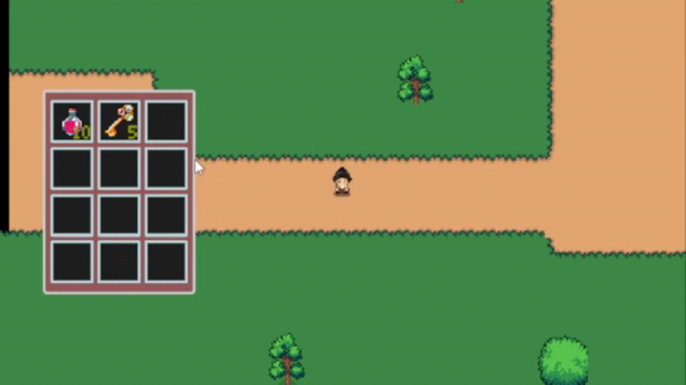
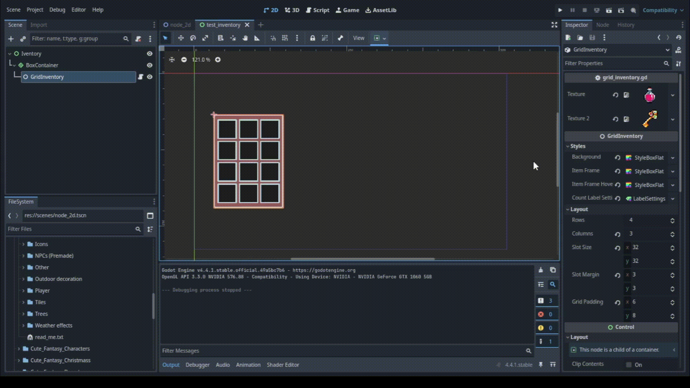

# Top-Down Action RPG Helpers (Godot 4.2+)

### A powerful and modular toolkit for building top-down action RPGs in Godot 4.2+, providing highly optimized, real-time, and configurable helper nodes to speed up development and enhance workflow.

---
#### Drag and drop inventory


---
#### Dynamic realtime grid stylized generation


---

## Purpose

Developers often need to reimplement the same building blocks for every top-down RPG or action game.  
This plugin aims to speed up development by offering **ready-to-use helpers** such as movement controllers, animation managers, and inventory systems.

---

## Objectives

- Provide **highly decoupled and reusable nodes** for top-down and action RPG projects.
- Focus on **action-oriented mechanics** (movement, combat helpers, animation, inventory).
- Allow developers to **extend or customize** without being locked into rigid frameworks.
- Foster **community contributions** through GitHub issues and pull requests.
- Release as **open source** under a permissive license.

---

## Features

### ✅ Implemented Helpers
- **GridInventory**
    - A **real-time, dynamic, and optimized grid-based inventory UI system**.
    - Handles visual representation with slots, drag & drop, stackable items, slot labels, and hover styles.
    - **UI-only**: it does not manage item data or backend logic — that is intentionally left for a separate class.
    - Highly **configurable and extensible**, making it adaptable to different RPG mechanics and custom interfaces.

- **FloatingCharacter2D**
    - Character movement for top-down games with acceleration, friction, and configurable **4-direction** or **8-direction** modes.
    - Emits signals for start/stop movement and direction changes.

- **AnimationController**
    - Centralized animation manager that integrates with **AnimationPlayer** and/or **AnimatedSprite2D**.
    - Uses **prefix/suffix naming** to automatically switch between animation states (e.g., `"walk_down"`, `"attack_left"`).

---

## Requirements

- **Godot 4.2 or later**
- Current distribution is via this GitHub repository.
- Plans to provide a **compiled plugin** in the future.

---

## Installation

1. Clone or download this repository into your Godot project’s `addons/` folder.
2. Enable the plugin in **Project Settings → Plugins** (when compiled release is available).
3. For now, helpers can be added by including the source nodes directly.

---

## Usage

Each helper is designed to be **self-contained**.  
Example usage:

- Attach `FloatingCharacter2D` to your player scene to handle top-down movement.
- Add `AnimationController` as a parent to an `AnimationPlayer` or `AnimatedSprite2D` to manage animations.
- Use `GridInventory` to build an RPG-style inventory system with drag & drop.

Code examples and demo scenes are included in the repository.

## 📌 Usage Examples

These examples demonstrate how to integrate `AnimationController` with `FloatingCharacter2D` for responsive character animation in a top-down RPG.

### Example 1 — Controlling Animations
```gdscript
extends AnimationController

var directions: Array = ["left", "right", "up", "down"]

func _on_floating_character_2d_start_move() -> void:
	set_animation_prefix("run")

func _on_floating_character_2d_stop_move() -> void:
	set_animation_prefix("idle")

func _on_floating_character_2d_direction_name_changed(move_direction_name: int) -> void:
	set_animation_suffix(directions[move_direction_name])

```

---
#### Example 2 — Moving a FloatingCharacter2D
##### FloatingCharacter could be any moveable node
```gdscript
extends FloatingCharacter2D

func _process(_delta: float) -> void:
	set_move_direction(Input.get_vector("left", "right", "up", "down"))

```

---

## Contributing

Contributions are welcome!
- Submit **issues** for bugs, ideas, or feature requests.
- Open **pull requests** with improvements or new helpers.

---

## License

- **Source Code**: Open source under [MIT License](./LICENSE).
- **Example Assets**: The demo project may include **third-party assets** protected by copyright.
    - These assets are provided **for demonstration purposes only**.
    - **You are not allowed to reuse or redistribute them** in your own projects.

---

## Roadmap

- [ ] Release compiled plugin version.
- [ ] Add more helper nodes (combat, AI, UI).
- [ ] Expand documentation and tutorials.  
